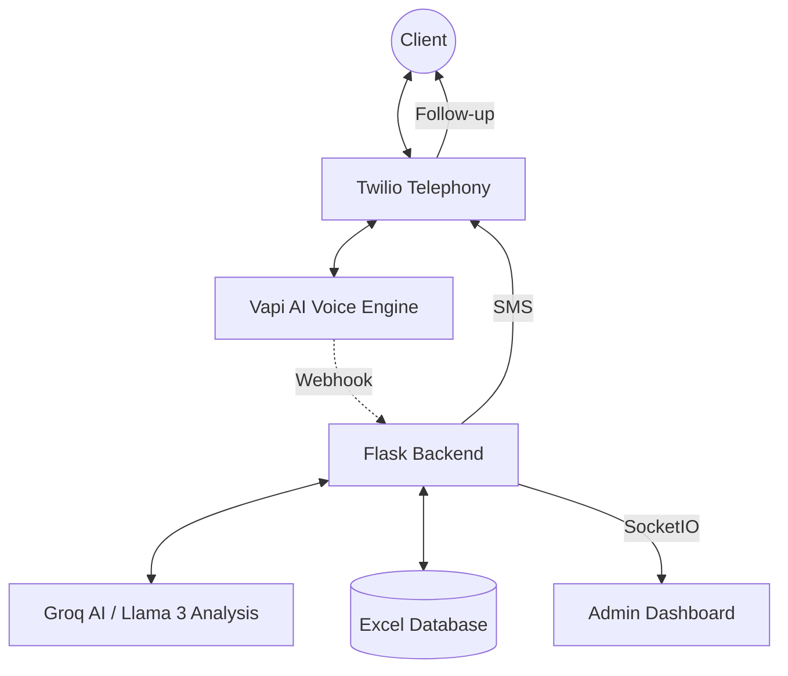
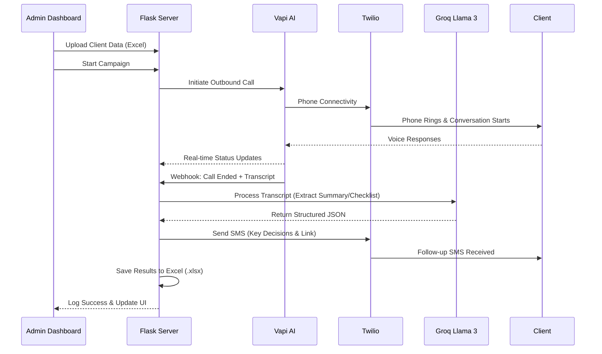

# CRM AI-Calling Agent: Anvriksh Cybersecurity Consultation

## 🚀 Overview
**CRM AI-Calling Agent** is a sophisticated, end-to-end automated calling and CRM integration system designed for **Anvriksh**. It leverages state-of-the-art AI technologies to conduct outbound cybersecurity consultation calls, evaluate client needs, and provide automated follow-ups via SMS and structured reports.

By integrating **Vapi** for conversational voice AI, **Twilio** for telephony and messaging, and **Groq** for high-speed LLM processing, this platform streamlines the lead-to-consultation funnel with zero manual intervention.

---

## 🏗️ High-Level Architecture

The system follows a modular architecture connecting real-time communication protocols with advanced LLM analysis.



### Core Components:
1.  **Voice Interaction Engine**: Built with **Vapi**, providing low-latency, human-like voice conversations.
2.  **Telephony Layer**: Integrated with **Twilio** for global phone connectivity and SMS delivery.
3.  **Intelligence Model**: Powered by **Groq**, using optimized models like Llama 3.3 for real-time transcript analysis and summary generation.
4.  **Backend Services**: A **Python/Flask** server managing state, orchestration, and real-time logging via **Socket.IO**.
5.  **Data Management**: Persistent storage using **Excel**, enabling easy migration and analysis of client responses.

---

## 🔄 Automated Workflow

The following diagram illustrates the lifecycle of a client consultation:



---

## 🛠️ Environment Configuration (.env)

The project requires several environment variables to establish connections with third-party providers. Create a `.env` file in the root directory with the following keys:

| Variable | Description | Source |
| :--- | :--- | :--- |
| `VAPI_API_KEY` | Your Vapi platform private key. | [vapi.ai](https://vapi.ai) |
| `VAPI_ASSISTANT_ID` | The ID of your pre-configured cybersecurity assistant. | Vapi Dashboard |
| `TWILIO_ACCOUNT_SID` | Your Twilio Account unique identifier. | [twilio.com](https://twilio.com) |
| `TWILIO_AUTH_TOKEN` | Your Twilio authentication token. | Twilio Console |
| `TWILIO_FROM_NUMBER` | The Twilio phone number used for calls and SMS. | Twilio Console |
| `GROQ_API_KEY` | API key for high-speed Llama 3 model processing. | [groq.com](https://groq.com) |
| `WEBHOOK_URL` | Public URL (ngrok/vps) for Vapi to send call results. | Your Server |

---

## 📦 Installation & Setup

1.  **Clone the Repository**:
    ```bash
    git clone https://github.com/RaJM2004/AI-Calling-Agent.git
    cd AI-Calling-Agent
    ```

2.  **Install Dependencies**:
    ```bash
    pip install -r requirements.txt
    ```

3.  **Configure Environment**:
    Create a `.env` file based on the section above.

4.  **Launch the System**:
    ```bash
    python main.py
    ```

5.  **Access the Dashboard**:
    Open `http://localhost:5000` in your browser.

---

## 📊 CRM Integration & Excel Output

The system generates a dynamic `client_response.xlsx` containing:
- **Timestamp**: Exact time of the consultation.
- **Transcript**: Word-for-word record of the AI conversation.
- **Summary**: AI-generated overview of client security concerns.
- **Checklist**: 3-point priority action plan for the client.
- **Call Report**: Detailed recording link and status.
- **SMS Status**: Confirmation of follow-up delivery.

---

## 🛡️ Security Features
- **Automatic Fallbacks**: Multiple LLM models (Llama 3.3, 3.2, 3.1) are cycled in case of API outages.
- **Atomic Writes**: Data is saved to Excel using temporary file buffering to prevent corruption.
- **Real-time Monitoring**: Interactive logs over SocketIO for live tracking of agent behavior.

Developed with ❤️ for **Anvriksh Cybersecurity**.
